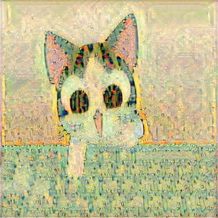

style_transfer
===================

Results
-------

 1. Examples

 2. Videos

 3. Reconstructions

 4. Ratio alpha/beta

Content
-------

 - [VGG](https://github.com/MonicaVillanueva/CNN_Style_Transfer/tree/master/style_transfer/VGG): Data structure for the VGG16 network and its weights in npz format.

 - [Dataset](https://github.com/MonicaVillanueva/CNN_Style_Transfer/tree/master/style_transfer/Dataset): Input images (content and style) for the generation of the different outputs in gen_images.

 - [gen_images](https://github.com/MonicaVillanueva/CNN_Style_Transfer/tree/master/style_transfer/gen_images): By default, folder in which the output is saved. It contains the pictures showed before.

